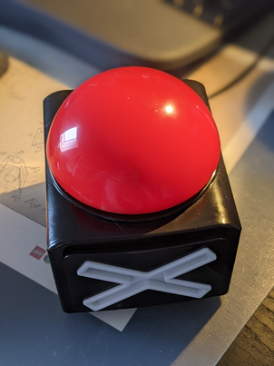

!!! PRESS THAT BUTTON !!!
=========================

Do you struggle finding the right button when being in a video call? Is it CMD + Shift + M? CMD + A? CMD + Q???

Don't worry anymore, build this big red button, press it and all the keys will be pressed by the button at the same time.

Build
-----

'But Mario, how do I build it?' Great question! The best is you 
1. buy a big red button, 
1. remove the internals (`the guts™️`), 
1. add a [Seeeed XIAO](https://www.seeedstudio.com/Seeeduino-XIAO-Arduino-Microcontroller-SAMD21-Cortex-M0+-p-4426.html) in it, 
1. use the [keyboard circuit python](https://circuitpython.org/board/seeeduino_xiao_kb/) build
1. add a button to the big button
1. wire up the lights
1. move the code.py to the CIRCUITPY drive, once attached
1. PRESS THE BUTTON
1. ...
1. success

Next steps
----------

No. ;)
